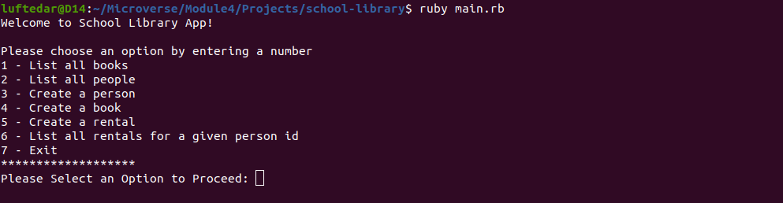

# School Library

> Imagine that you are the librarian of OOP University, and you need a tool to record what books are in the library and who borrows them. The app that you will create will allow a you to, add new students or teachers, add new books, save records of who borrowed a given book and when. And all of this will be built in a beautiful and well-organized way!



## Built With

- Ruby

## Getting Started


To get a local copy up and running follow these simple example steps.

Clone this repository:

```
git clone https://github.com/luftedar/school-library.git
```


cd into folder:

```
cd schoold-library
```

To get started, run following in the root directory:

```
gem install bundler
```

Install bundle

```
bundle install
```

Run main file
```
ruby main.rb
```

Run following to check linter errors:

```
rubocop
```

Auto fix the errors if available

```
rubocop -A
```


## Authors

👤 **Orçun Uğur**

- GitHub: [@githubhandle](https://github.com/luftedar)
- LinkedIn: [LinkedIn](https://www.linkedin.com/in/orcunugur)

## 🤝 Contributing

Contributions, issues, and feature requests are welcome!

Feel free to check the [issues page](../../issues/).

## Show your support

Give a ⭐️ if you like this project!

## Acknowledgments

- This project is built in Microverse's fourth module's second week.

## 📝 License

This project is [MIT](./MIT.md) licensed.
